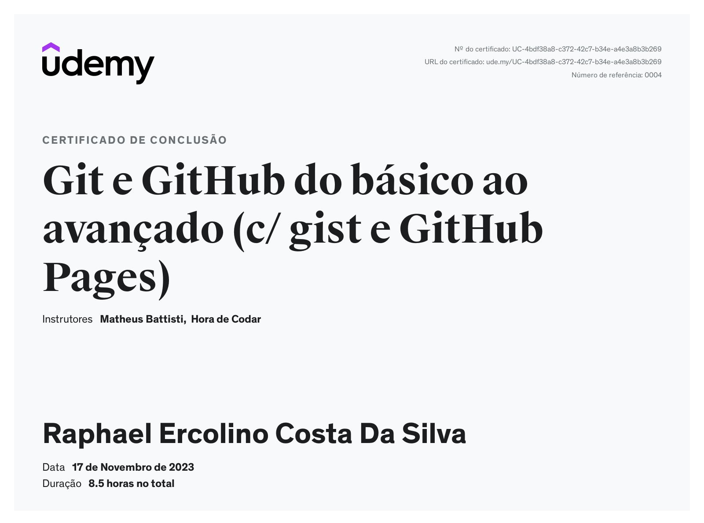
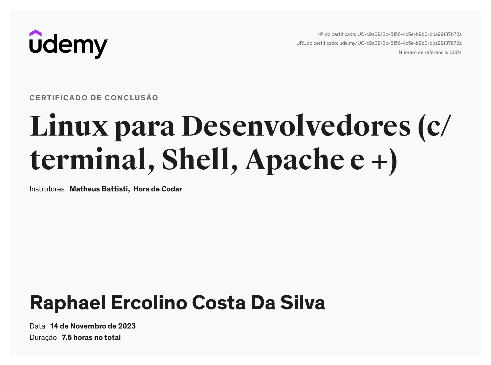

# Sprint 1 - Minha Experiência em Desenvolvimento Web

Na primeira sprint adquiri os conhecimentos necessários para utilizar maquinas virtuais, adquiri conhecimentos para a manipulação de comandos básicos ao avançado em Linux, manipulação de diretórios, compactação e descompactação de arquivos entre outras funcionalidades do Linux, desenvolvi competências necessárias para utilizar o git, utilizando os principais comandos do git , controles de versões para encaminhar para o repositório remoto o github e a criação e desenvolvimentos de arquivos markdown, como por exemplo o read.me.

## Tecnologias e Habilidades

- **Linux:** Desenvolvi habilidades para manipulação de diretórios e manipulação de máquinas virtuais.
- **Git:** Tenho sólidos conhecimentos em Git e controle de versões.
- **Github:** Adquiri conhecimentos necessários que permitem que os desenvolvedores colaborem e façam mudanças no projeto.
- **Markdown:** Desenvolvi Habilidades de linguagem voltada para formatação de textos, utilizando o read.me.

## Certificados 

## Evidências
.png)
.png)

## Próximos Passos

Para o próximo sprint, planejo explorar mais minhas habilidades e conhecimentos sobre tecnologia.

Continue lendo [aqui](../Sprint2/README.md) para descobrir mais sobre a próxima sprint.
