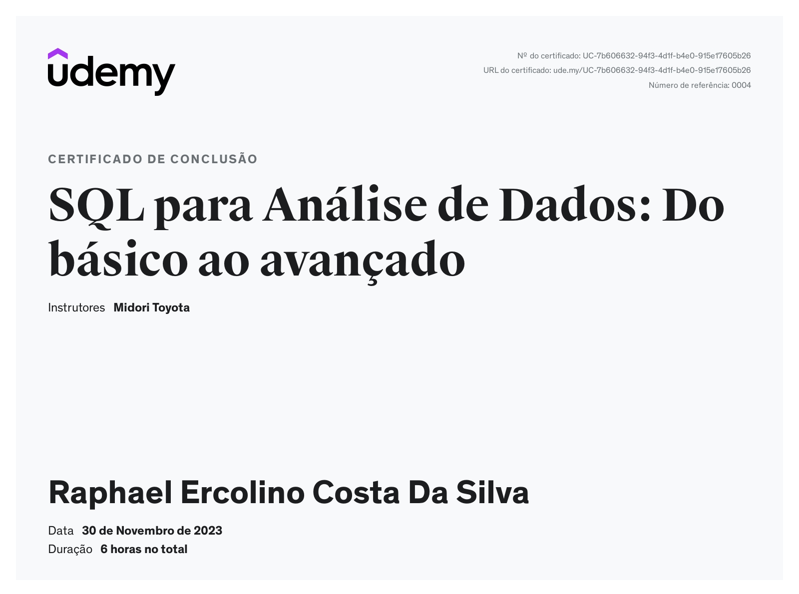

# Sprint 2 - 

Nesta sprint desenvolvi habilidades suficientes para desenvolver querys utilizando o sql e desenvolvi habilidades e  conhecimentos teóricos de BigData.

## Tecnologias e Habilidades

- SQL
- BigData

### Certificação 

### Evidências
##### Exercício 1

##### Exercício 2

### Arquivos csv
##### Arquivo 1

##### Arquivo 2

## Próximos Passos

Para o próximo sprint, estou planejando explorar mais a fundo as tecnologias relacionadas.

Continue lendo [aqui](../Sprint3/README.md) para descobrir mais sobre minhas habilidades nessa nova tecnologia.
