# Sprint 4 - Python

Nesta sprint desenvolvi habilidades em docker , habilidades para manipular containers e imagens do docker, aprendi conceitos em python para manipulação de dados , desenvovi habilidades em segurança em aplicações web , metodologia de método ágeis .
## Tecnologias e Habilidades

- Docker 
- Phyton 
- Segurança em aplicações web
- Metodologia de Métodos ágeis 
### Certificação 

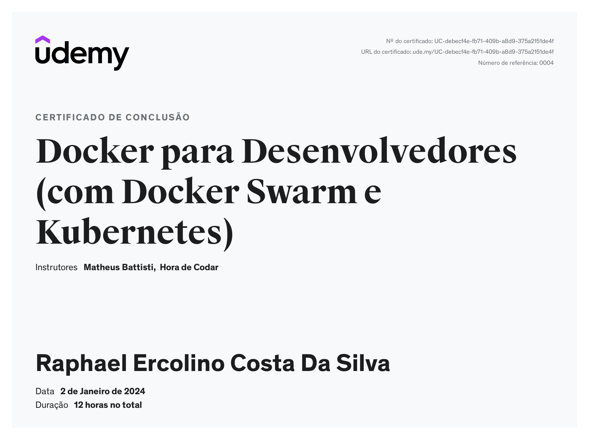

### Exercício 
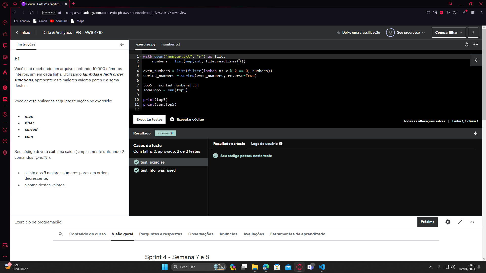
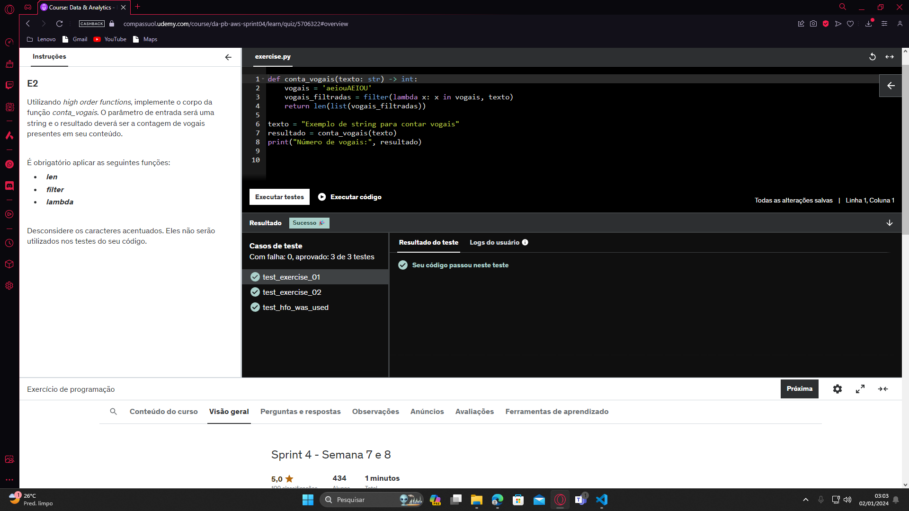
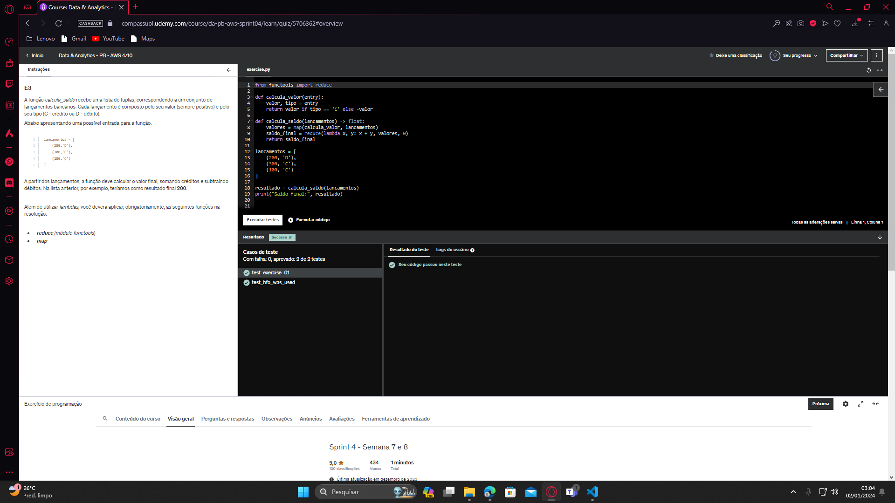
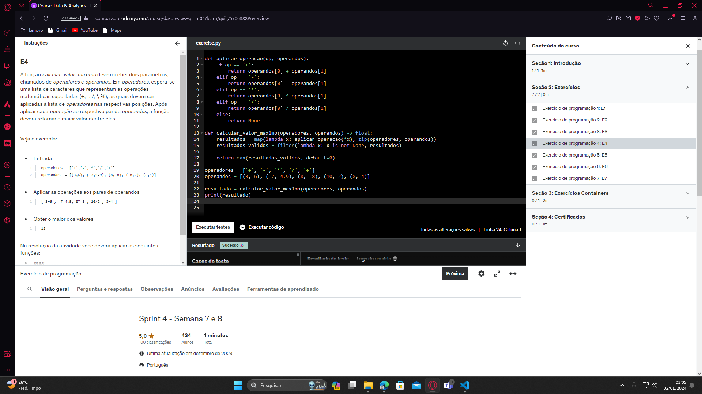
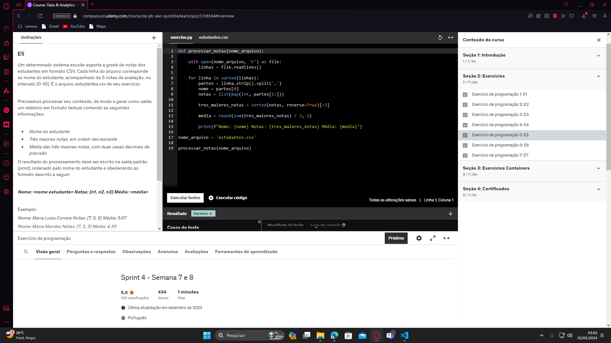
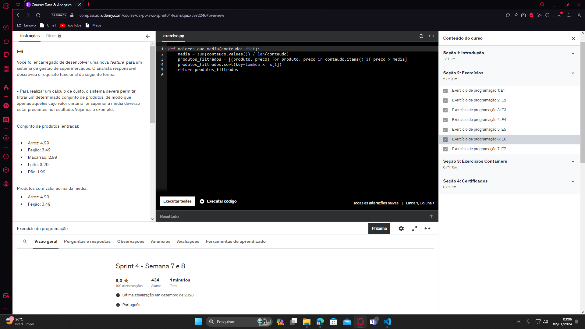
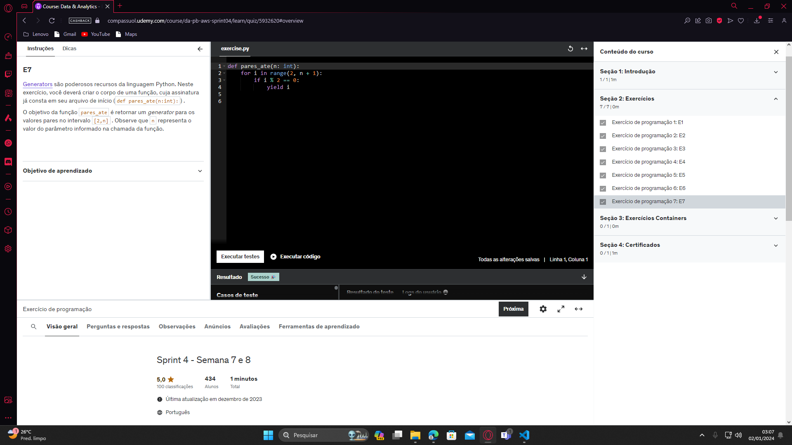

### Desafio 

#### Exercício 1
- DockerFile
FROM python:3.8
COPY . /app
WORKDIR /app
CMD ["python", "carguru.py"]

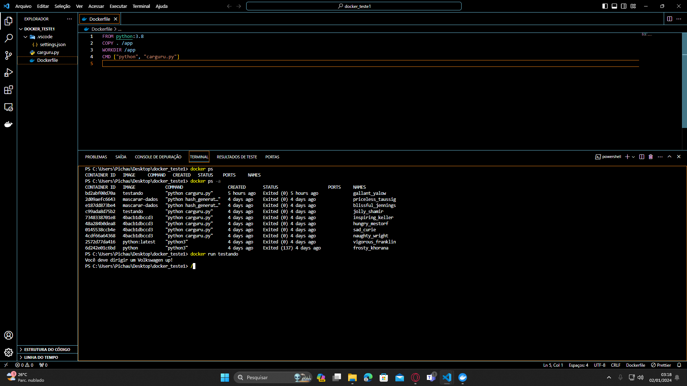

#### Exercício 2
***2.É possível reutilizar containers? Em caso positivo, apresente o comando necessário para reiniciar um dos containers parados em seu ambiente Docker? Não sendo possível reutilizar, justifique sua resposta.***
R= Sim, é possível reutilizar containers no Docker. Para reiniciar um container parado, use o comando:Containers são feitos para serem reiniciados e reutilizados facilmente. Se um container foi removido ou não pode ser reiniciado, não será possível reutilizá-lo; será necessário criar um novo container com base na imagem original.

### Exercício 3 
-- Criar novo script Python que implementa o algoritmo:

import hashlib
while True:
    user_input = input("Digite uma string para gerar o hash (ou 'exit' para sair): ")

    if user_input.lower() == 'exit':
        break

    hash_object = hashlib.sha1(user_input.encode())
    hash_hex = hash_object.hexdigest()

    print(f"Hash SHA-1 da string '{user_input}': {hash_hex}\n")

DockerFile

FROM python:3.9
WORKDIR /app
COPY hash_generator.py /app/hash_generator.py
CMD ["python", "hash_generator.py"]

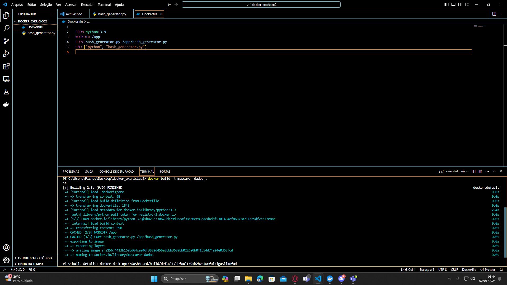
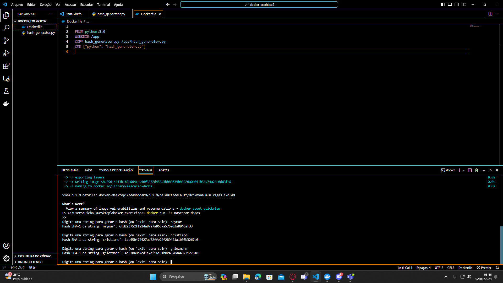

## Próximos Passos

Para o próximo sprint, estou planejando explorar mais a fundo as tecnologias relacionadas.

Continue lendo [aqui](../Sprint5/README.md) para descobrir mais sobre minhas habilidades nessa nova tecnologia.
