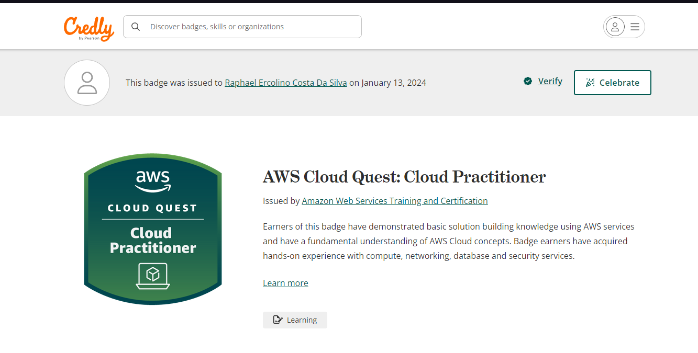
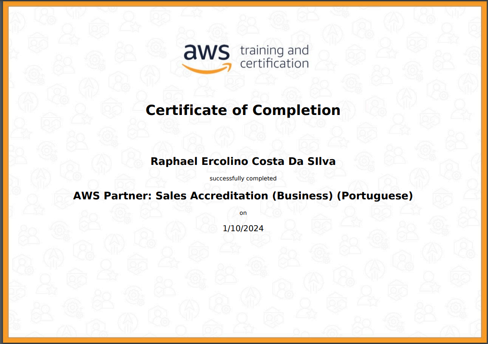
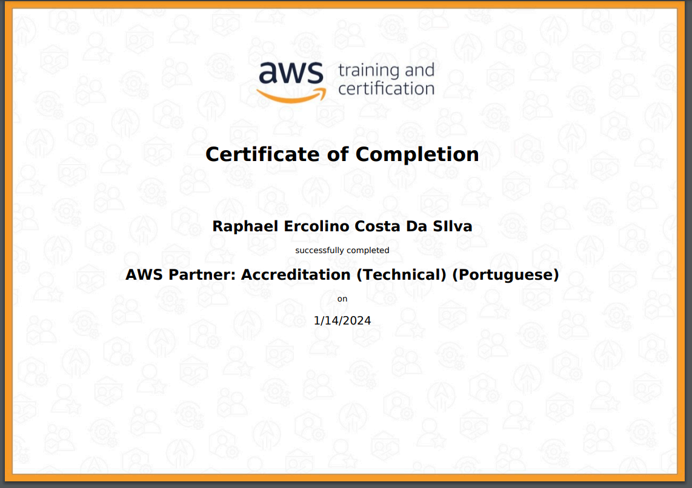
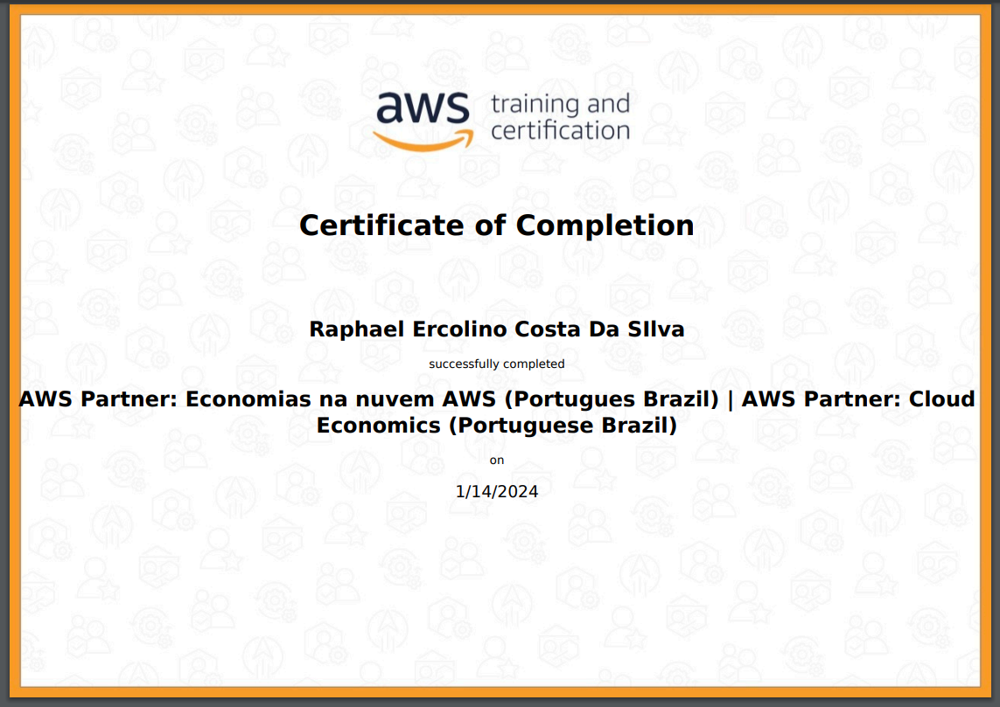
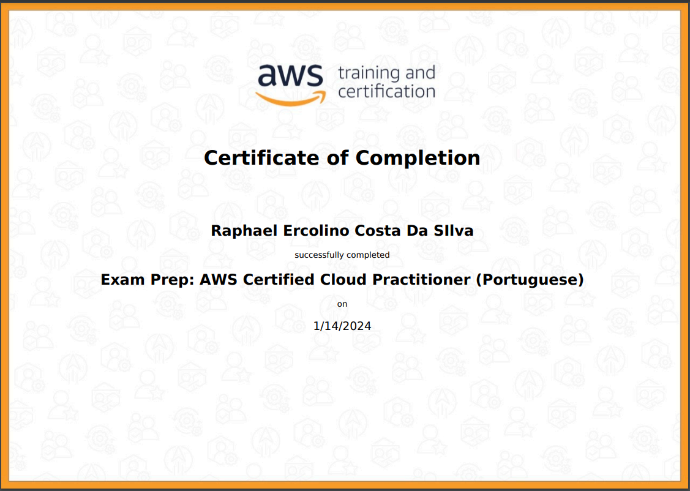

# Sprint 3 - 

Nesta sprint desenvolvi habilidades em AMAZON WEB SERVICES, serviços esses voltados para computação em nuvem,adquiri habilidades para manipular dados na nuvem, criação de máquinas virtuais, criação de banco de dados,entre outras ferramentas, por meio do game da AWS CLOUD QUEST, consegui desemvolver e praticar com os serviços ofertados pela AWS, adquirindo habilidades e conhecimentos básicos para se trabalhar na nuvem.
## Tecnologias e Habilidades

- Amazon Web Services: AWS
### Certificação 

## Próximos Passos

Para o próximo sprint, estou planejando explorar mais a fundo as tecnologias relacionadas.

Continue lendo [aqui](../Sprint6/README.md) para descobrir mais sobre minhas habilidades nessa nova tecnologia.