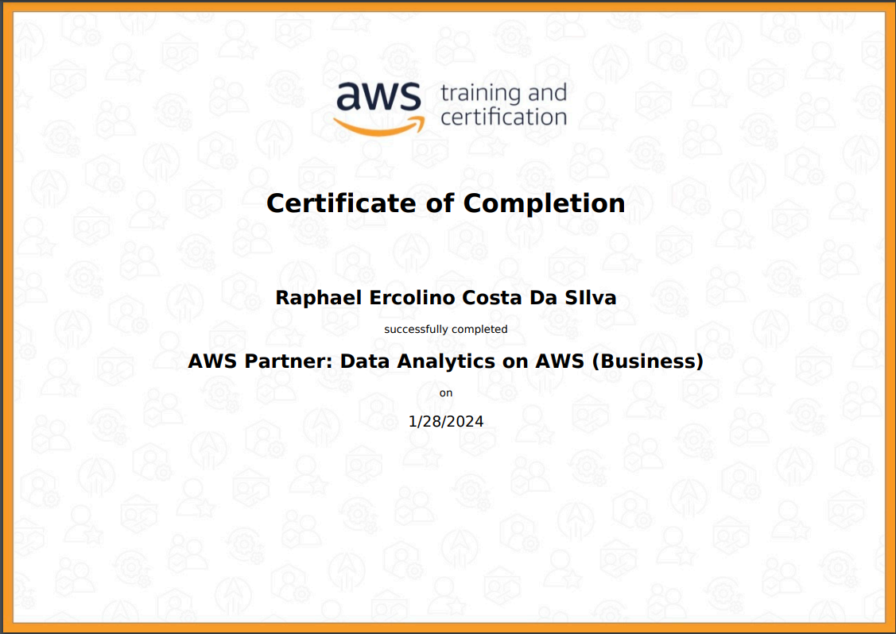
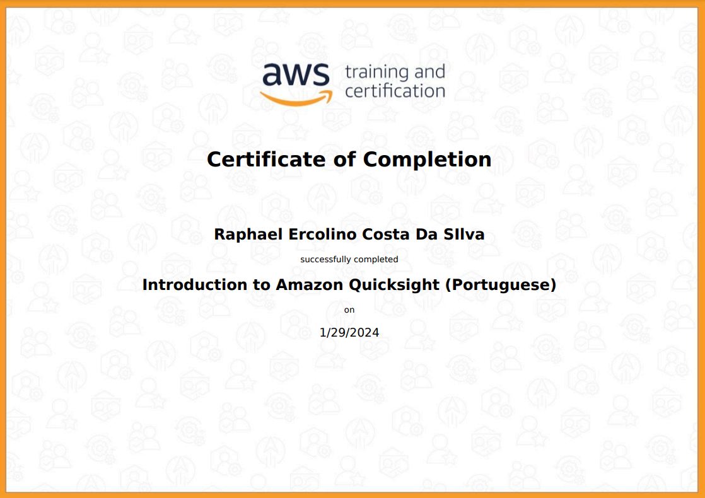

# Sprint 5 - Amazon Web Services: AWS

Nesta sprint desenvolvi habilidades em AMAZON WEB SERVICES, serviços esses voltados para computação em nuvem,adquiri habilidades para manipular dados na nuvem, subir dados para nuvem e usar o aws lambda para utilizar funções em docker.

## Tecnologias e Habilidades

- Amazon Web Services: AWS

### Certificação 

### Evidências

- **Lab Aws s3**

- **Lab Aws Athena**

- **Lab Aws Lambda**

- **Lab Aws 4**

## Próximos Passos

Para o próximo sprint, estou planejando explorar mais a fundo as tecnologias relacionadas.

Continue lendo [aqui](../Sprint7/README.md) para descobrir mais sobre minhas habilidades nessa nova tecnologia.

