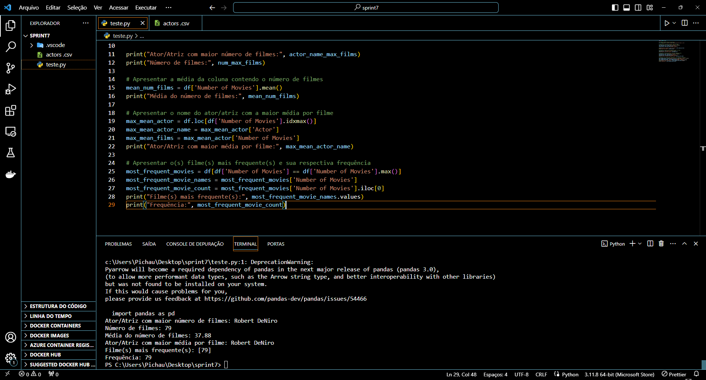
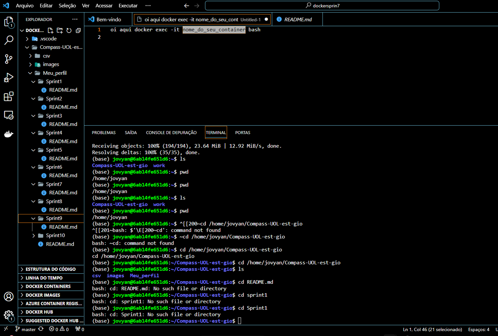
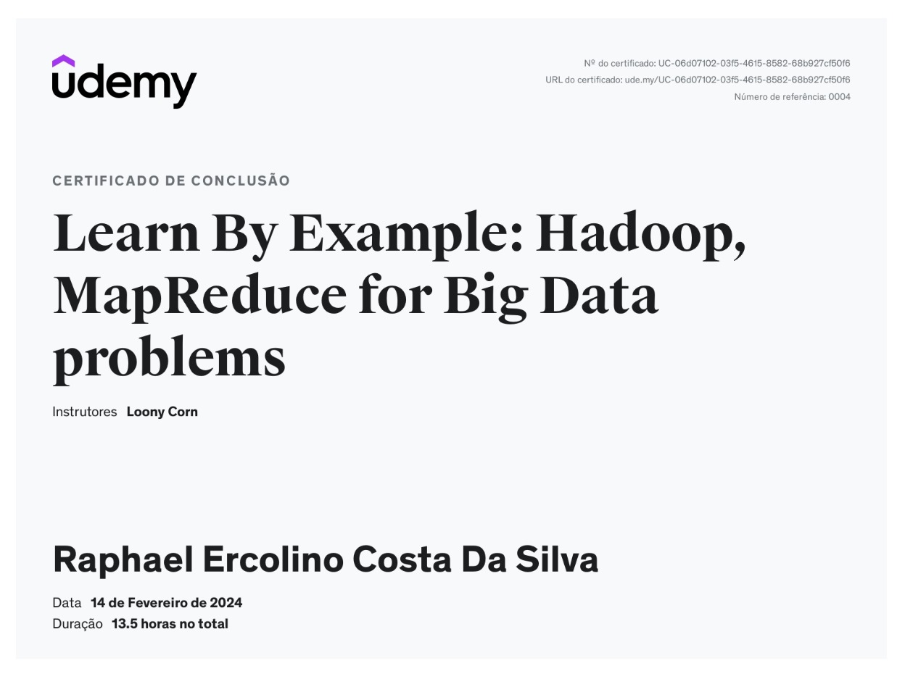

# Sprint 7 - Spark e Hadoop

O curso abrangente sobre Spark e Hadoop me proporcionou o conhecimento e as habilidades necessárias para lidar com eficiência e eficácia com grandes volumes de dados em ambientes distribuídos, capacitando-me a construir e implementar soluções robustas de análise e processamento de dados.

## Tecnologias e Habilidades

- Haadop
- Spark

### Sessão 3

#### Tarefa: Python com Pandas e Numpy

import pandas as pd
df = pd.read_csv ("C:\\Users\\Pichau\\Desktop\\sprint7\\actors .csv")
actor_max_films = df.loc[df['Number of Movies'].idxmax()]
actor_name_max_films = actor_max_films['Actor']
num_max_films = actor_max_films['Number of Movies']
print("Ator/Atriz com maior número de filmes:", actor_name_max_films)
print("Número de filmes:", num_max_films)
mean_num_films = df['Number of Movies'].mean()
print("Média do número de filmes:", mean_num_films)
max_mean_actor = df.loc[df['Number of Movies'].idxmax()]
max_mean_actor_name = max_mean_actor['Actor']
max_mean_films = max_mean_actor['Number of Movies']
print("Ator/Atriz com maior média por filme:", max_mean_actor_name)
most_frequent_movies = df[df['Number of Movies'] == df['Number of Movies'].max()]
most_frequent_movie_names = most_frequent_movies['Number of Movies']
most_frequent_movie_count = most_frequent_movies['Number of Movies'].iloc[0]
print("Filme(s) mais frequente(s):", most_frequent_movie_names.values)
print("Frequência:", most_frequent_movie_count)

#### Tarefa: Apache Spark - Contador de Palavras

lines = sc.textFile("file:///home/jovyan/Compass-UOL-est-gio/README.md")
words = lines.flatMap(lambda line: line.split())
word_counts = words.map(lambda word: (word, 1)).reduceByKey(lambda a, b: a + b)
word_counts.collect()

### Certificados 

## Próximos Passos

Para o próximo sprint, estou planejando explorar mais a fundo as tecnologias relacionadas.

Continue lendo [aqui](../Sprint8/README.md) para descobrir mais sobre minhas habilidades nessa nova tecnologia.
