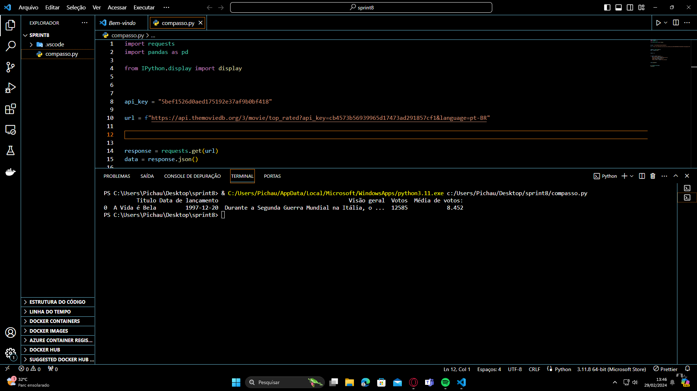
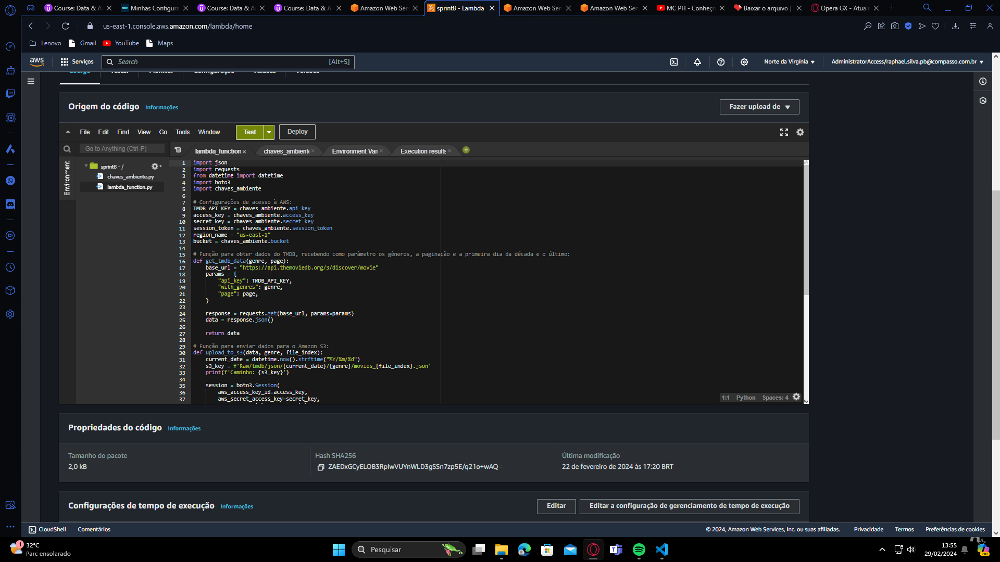
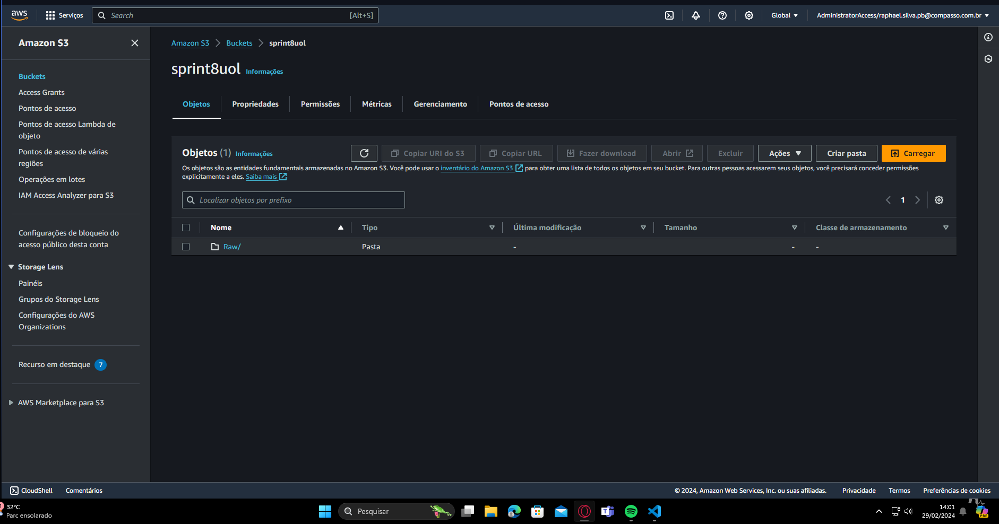
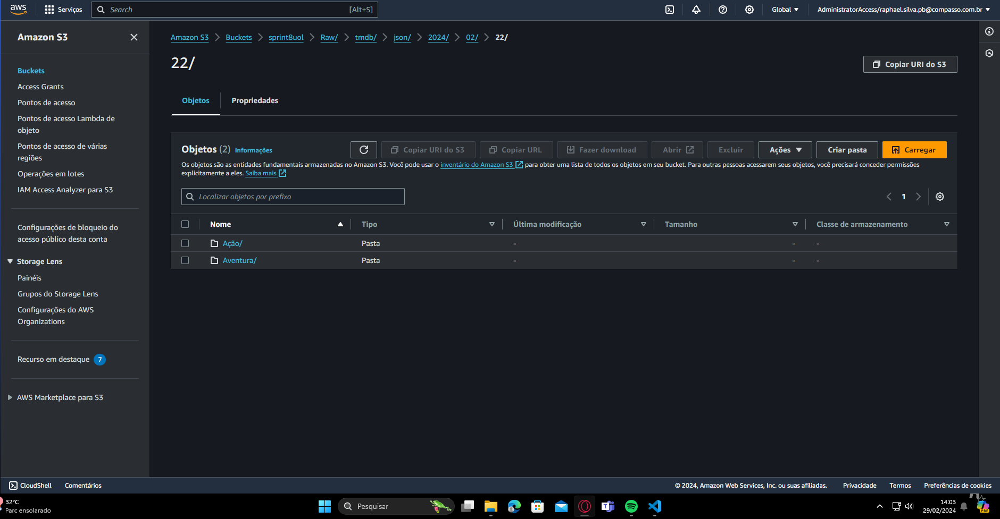

# Sprint 8- AWS Services 

Nessa sprint fui capaz de importar dados do TMDB para ingestão de dados, por meio de função usando a IDE e também pude usar a aws lambda.

## Tecnologias e Habilidades

- AWS Services

### Tarefa 1: Exercício TMDB
import requests
import pandas as pd
from IPython.display import display
api_key = "5bef1526d0aed175192e37af9b0bf418"
url = f"https://api.themoviedb.org/3/movie/top_rated?api_key=cb4573b56939965d17473ad291857cf1&language=pt-BR"
response = requests.get(url)
data = response.json()
filmes = []
for movie in data['results']:
    df = {'Titulo': movie['title'],
    'Data de lançamento': movie['release_date'],
    'Visão geral': movie['overview'],
    'Votos': movie['vote_count'],
    'Média de votos:': movie['vote_average']}

filmes.append(df)

df = pd.DataFrame(filmes)
display(df)

### Tarefa 2: Ingestão de dados TMDB
import json
import requests
from datetime import datetime
import boto3
import chaves_ambiente
TMDB_API_KEY = chaves_ambiente.api_key
access_key = chaves_ambiente.access_key
secret_key = chaves_ambiente.secret_key
session_token = chaves_ambiente.session_token
region_name = "us-east-1"
bucket = chaves_ambiente.bucket
def get_tmdb_data(genre, page):
    base_url = "https://api.themoviedb.org/3/discover/movie"
    params = {
        "api_key": TMDB_API_KEY,
        "with_genres": genre,
        "page": page,
    }

    response = requests.get(base_url, params=params)
    data = response.json()

    return data

def upload_to_s3(data, genre, file_index):
    current_date = datetime.now().strftime("%Y/%m/%d")
    s3_key = f'Raw/tmdb/json/{current_date}/{genre}/movies_{file_index}.json'
    print(f'Caminho: {s3_key}')

    session = boto3.Session(
        aws_access_key_id=access_key,
        aws_secret_access_key=secret_key,
        aws_session_token=session_token,
        region_name=region_name
    )

    s3 = session.client("s3")
    print("Sessão criada")

    s3.put_object(Body=json.dumps(data), Bucket=bucket, Key=s3_key)
    print(f'Dados carregados para S3: s3://{bucket}/{s3_key}')

def lambda_handler(event, context):
    genres = {
        "Ação": "28",
        "Aventura": "12",
    }

    for genre, genre_id in genres.items():
        for file_index in range(1, 101):  # Criar 10 arquivos
            movies = []
            for page in range(1, 6):  # Cada arquivo terá 5 páginas com 20 filmes cada
                tmdb_data = get_tmdb_data(genre_id, page=page)
                movies.extend(tmdb_data.get("results", []))

            # Cada arquivo terá 100 filmes
            movies = movies[:100]

            upload_to_s3(movies, genre, file_index)

    return {"statusCode": 200, "body": json.dumps("Dados salvos com sucesso no S3.")}

## Próximos Passos

Para o próximo sprint, estou planejando explorar mais a fundo as tecnologias relacionadas.

Continue lendo [aqui](../Sprint9/README.md) para descobrir mais sobre minhas habilidades nessa nova tecnologia.
